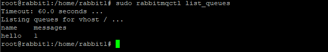
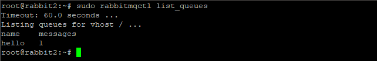

# Домашнее задание к занятию  «Очереди RabbitMQ»

### Задание 1. Установка RabbitMQ

Используя Vagrant или VirtualBox, создайте виртуальную машину и установите RabbitMQ.
Добавьте management plug-in и зайдите в веб-интерфейс.

*Итогом выполнения домашнего задания будет приложенный скриншот веб-интерфейса RabbitMQ.*

---
### Ответ:


---
### Задание 2. Отправка и получение сообщений
Используя приложенные скрипты, проведите тестовую отправку и получение сообщения.
Для отправки сообщений необходимо запустить скрипт **producer.py**.

Зайдите в веб-интерфейс, найдите очередь под названием **hello** и сделайте скриншот.
После чего запустите второй скрипт **consumer.py** и сделайте скриншот результата выполнения скрипта

*В качестве решения домашнего задания приложите оба скриншота, сделанных на этапе выполнения.*

---
### Ответ:

- вид из GUI:


- очередь **hello** создалась:


- работа скрипта в терминале:


- вид из GUI после запуска скрипта:


---

### Задание 3. Подготовка HA кластера

Используя Vagrant или VirtualBox, создайте вторую виртуальную машину и установите RabbitMQ.
Добавьте в файл hosts название и IP-адрес каждой машины, чтобы машины могли видеть друг друга по имени.

Пример содержимого hosts файла:
```shell script
$ cat /etc/hosts
192.168.0.10 rmq01
192.168.0.11 rmq02
```
После этого ваши машины могут пинговаться по имени.

Затем объедините две машины в кластер и создайте политику ha-all на все очереди.

*В качестве решения домашнего задания приложите скриншоты из веб-интерфейса с информацией о доступных нодах в кластере и включённой политикой.*

Также приложите вывод команды с двух нод:

```shell script
$ rabbitmqctl cluster_status
```

Для закрепления материала снова запустите скрипт producer.py и приложите скриншот выполнения команды на каждой из нод:

```shell script
$ rabbitmqadmin get queue='hello'
```

После чего попробуйте отключить одну из нод, желательно ту, к которой подключались из скрипта, затем поправьте параметры подключения в скрипте consumer.py на вторую ноду и запустите его.

*Приложите скриншот результата работы второго скрипта.*

---
### Ответ:

- поднял 2-ю машину + установл и настроил там RabbitMQ.
- на первой и второй машине в файле **hosts** добавил IP-адреса и имена обеих машин
```
echo "192.168.0.136 rabbit1" >> /etc/hosts
echo "192.168.1.140 rabbit2" >> /etc/hosts
```
- для работы кластера RabbitMQ все узлы должны иметь одинаковое значение кэша. Я скопировал значение файла */var/lib/rabbitmq/.erlang.cookie* с rabbit1 на rabbit2 + убедился, что значения идентичны.
- перезапуск службы на **rabbit2**
```
systemctl restart rabbitmq-server
```
- остановка и сброс
```
rabbitmqctl stop_app
rabbitmqctl reset
```
- подключение к кластеру и запуск
```
rabbitmqctl join_cluster rabbit@rabbit1
rabbitmqctl start_app
```
- создание политики, для зеркалирования очереди для всех узлов в кластере на **rabbit1**
```
rabbitmqctl set_policy ha-all ".*" '{"ha-mode":"all"}'
```
- результат кластеризации на GUI:


- результат создания политики:


- проверка статуса кластеров
```
rabbitmqctl cluster_status
```
- на **rabbit1**:


- на **rabbit2**:


- отправка сообщения на **rabbit1** и проверяю работу очереди на обеих машинах:





- отключаю **rabbit1**:


- запускаю **consumer.py** и получаю сообщение:


